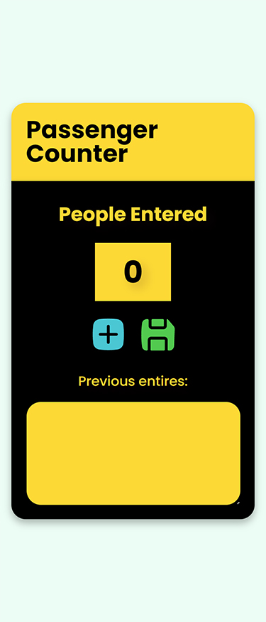
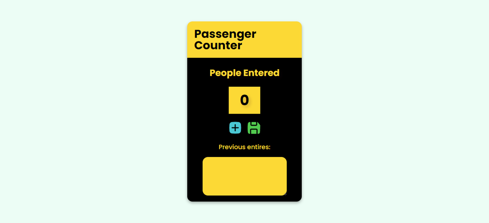

# Passenger Counter App

## Table of contents

- [Overview](#overview)
  - [Screenshot](#screenshot)
  - [Links](#links)
- [My Process](#my-process)
  - [Languages and Tools](#languages-and-tools)
  - [Built With](#built-with)
  - [What I Learnt](#what-i-learnt)
  - [Useful Resources](#useful-resources)
- [Author](#author)

## Overview

### Screenshot

#### Mobile

#### Desktop

### Links

- [Live 🔗](https://iqra0001.github.io/Passenger-Counter-App/)

## My process

### Languages and Tools

- HTML5
- CSS3
- JavaScript
- Sublime Text 3

### Built With

- Desktop first workflow
- Semantic HTML5 markup
- Custom CSS Properties
- CSS Flexbox
- Vanilla JavaScript

### What I Learnt

- Customization of SVG icon colors with CSS filters
- Use of rem for font-size instead of fixed units like px in order to make the design responsive by simply adjusting the font-size of the root element in the media query
- Basics of JavaScript like declaring variables, using various data types (string, number, boolean etc) to assign values to variables and creating functions to perform a specific task

### Useful Resources

- [CSS em and rem explained](https://youtu.be/_-aDOAMmDHI) - Helped to understand em and rem better
- [Learn JavaScript for free](https://scrimba.com/learn/learnjavascript) - Literally the best JavaScript course for beginners

### Acknowledgements

- [Scrimba](https://scrimba.com)

## Author

- LinkedIn - [Iqra Zaheer](https://www.linkedin.com/in/iqra-zaheer-45bb42231/)
- Github - [@iqra0001](https://github.com/iqra0001)
- Frontend Mentor - [@iqra0001](https://www.frontendmentor.io/profile/iqra0001)
- Instagram - [Iqra Zaheer](https://www.instagram.com/iqraaa0001/)
